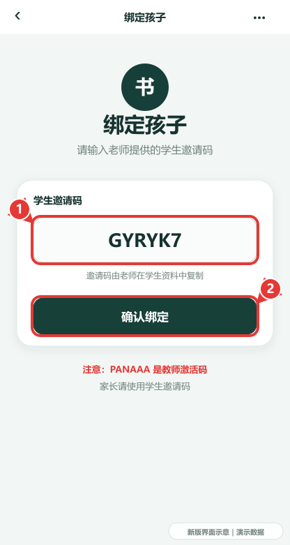
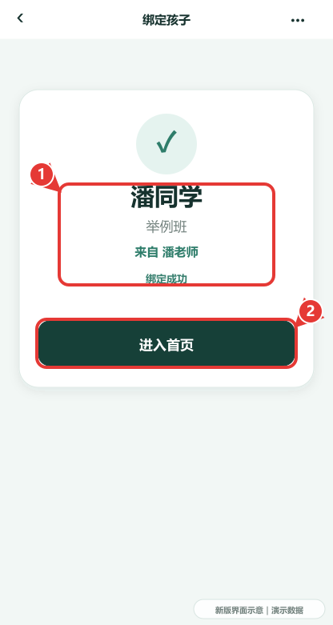
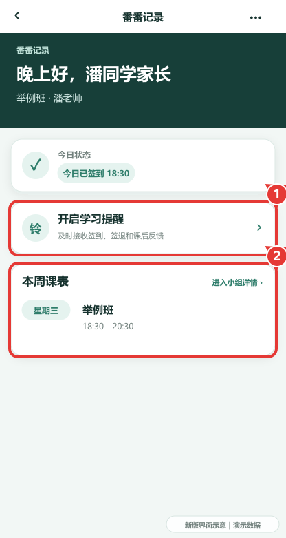
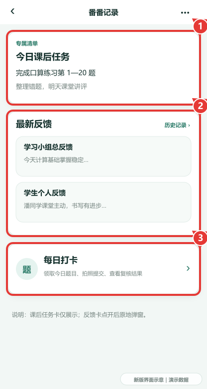
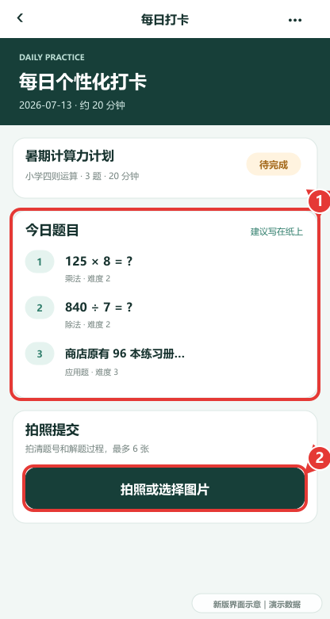
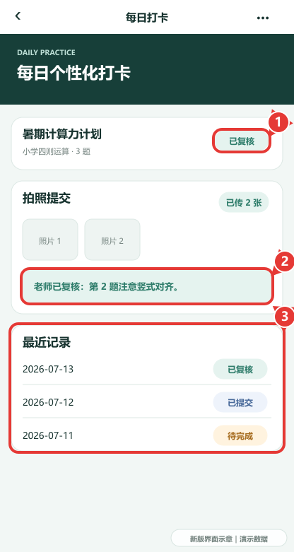
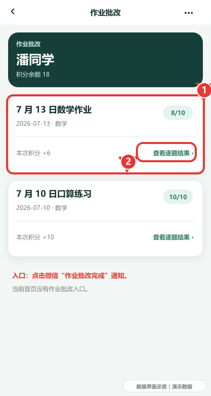
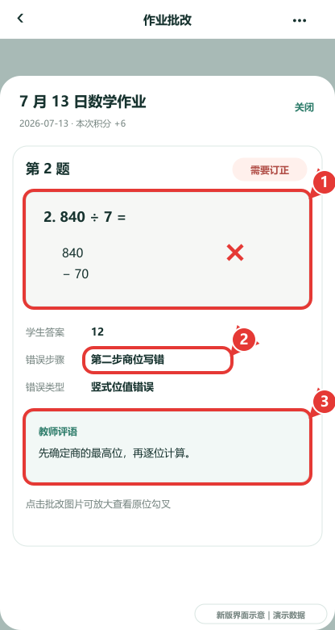

# 番番记录｜家长使用说明书

适用版本：微信小程序体验代码 `1.2.1`
更新日期：2026-07-13

> 当前家长端配图根据体验版最新界面生成，人物、课程、反馈和作业数据均为操作演示。微信授权、订阅通知、相机相册及私有图片预览，以实际手机界面为准。所有示意图右下角均标有“新版界面示意｜演示数据”。

## 1. 登录并绑定孩子

1. 打开“番番记录”，点“微信登录”。
2. 首次使用会自动进入“绑定孩子”。
3. 在 **① 学生邀请码** 输入老师发来的邀请码。
4. 点 **② 确认绑定**。

> 家长不能输入 `PANAAA`。`PANAAA` 是教师激活码。本文演示学生邀请码为 `GYRYK7`。

5. 核对 **① 孩子、学习小组、老师**。
6. 点 **② 进入首页**。

## 2. 家长首页

首页顶部依次显示：孩子问候、学习小组和老师、今日状态。

1. 点 **① 开启学习提醒**，允许接收签到、签退和课后反馈通知。
2. 点 **② 本周课表**，进入学习小组详情。

首页中部：

1. **① 今日课后任务**：单独显示老师在小组反馈中布置的作业说明；该卡仅展示，不能点击。
2. **② 最新反馈**：点“学习小组总反馈”或“学生个人反馈”，详情会在首页原地弹出；点标题进入历史列表。
3. **③ 每日打卡**：进入当天个性化题目。

点微信“课后反馈”通知后会回到家长首页，再从“最新反馈”查看内容。

## 3. 每日打卡

1. 首页点“每日打卡”。
2. 系统自动领取并加载当天题目，没有单独的“领取”按钮。
3. 查看 **① 今日题目**，让孩子在纸上写清题号和过程。
4. 点 **② 拍照或选择图片**；最多上传 6 张。

上传后：

- 按钮变为“继续补充照片”；
- 显示“已传 X 张”；
- 状态显示“已提交”，等待老师复核。

老师复核后：

1. **① 状态**变为“已复核”。
2. **② 老师说明**显示需要巩固的题目。
3. **③ 最近记录**可查看待完成、已提交、已复核状态。

## 4. 查看 AI 作业批改

当前入口是微信“作业批改完成”通知，家长首页没有作业批改入口。

1. 点微信作业通知进入“作业批改”。
2. 点 **① 作业卡片**，或点 **② 查看逐题结果**。

逐题详情中可看：

1. **① 原位勾叉批改图**；点击图片可放大。
2. **② 学生答案、错误步骤、错误类型**。
3. **③ 教师评语**。

## 5. 请假与反馈建议

首页下方“常用服务”提供：

- 请假申请：选择日期、填写原因、提交并查看审批状态。
- 反馈建议：直接给潘老师留言。

## 6. “我的”页面

- 查看当前绑定的孩子。
- 绑定其他孩子。
- 解除不再需要的绑定。
- 同一微信同时具有教师、家长身份时，可切换角色。
- 遇到登录异常，可回登录页点“登录失败修复”。

## 7. 隐私说明

- 小程序不收集电话号码。
- 作业原图、每日打卡照片、AI 批改图采用私有存储和鉴权下载。
- 每名学生使用统一学生 ID，避免同名学生数据混淆。
- 不要把学生邀请码公开发布；只发给对应家长。

## 8. 常见问题

- 首页只显示“晚上好，XXX 家长”、上半部分像被吞掉：下拉刷新或重新进入；最新版会在数据加载后自动回到页面顶部。
- 没看到“今日课后任务”：当天没有作业说明时会显示空状态。
- 没有“领取题目”按钮：正常。进入“每日打卡”后系统自动领取。
- 拍照上传失败：检查网络、相机/相册权限；单次最多 6 张。
- 看不到 AI 作业批改：从微信作业通知进入；当前首页没有入口。
- 邀请码错误：联系老师重新复制学生邀请码；不要使用 `PANAAA`。
