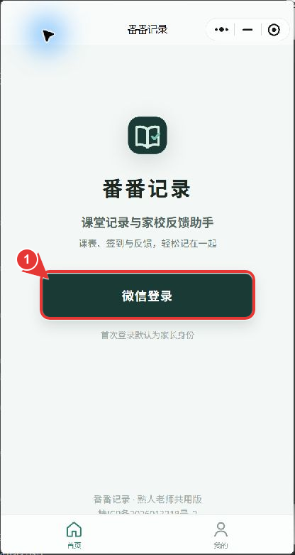
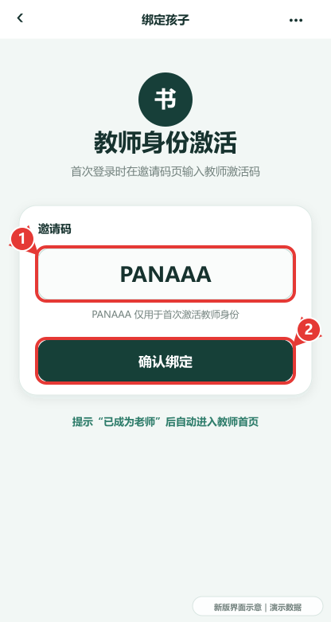
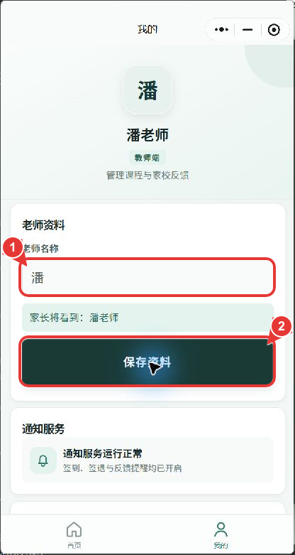
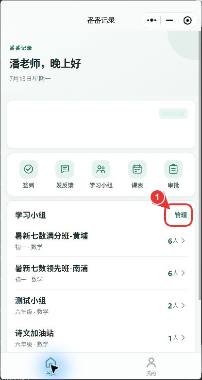
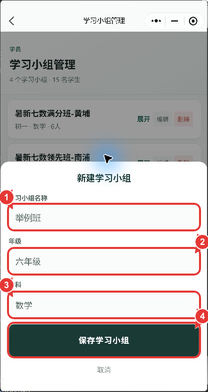
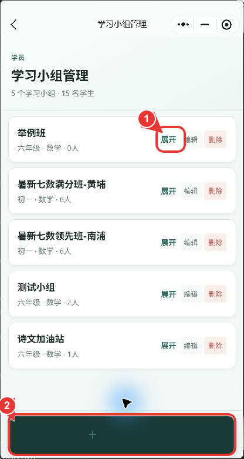
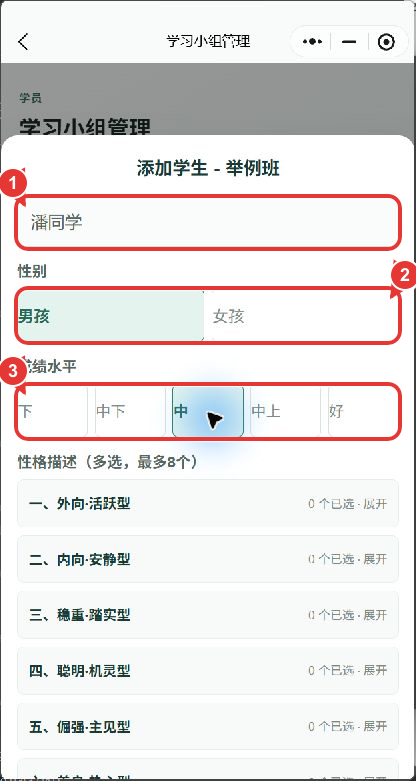
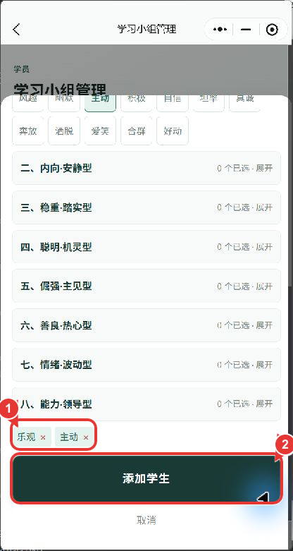
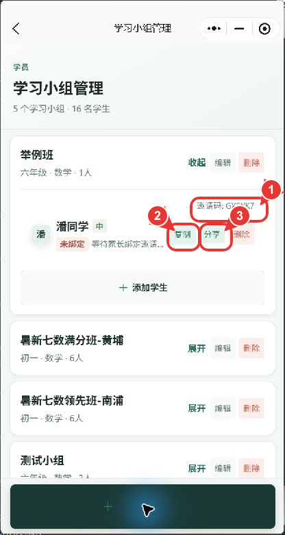

# 番番记录｜教师使用说明书

适用版本：微信小程序体验代码 `1.2.1`
更新日期：2026-07-13

> `PANAAA` 是教师身份激活码，不是用户名或密码。首次激活一次即可。本文已用当前微信账号实际完成：教师登录、名称改为“潘老师”、新建“举例班”、新建“潘同学”。

## 1. 登录与教师身份激活

1. 打开“番番记录”，点图中 **① 微信登录**。
2. 首次登录默认是家长身份；在邀请码页输入 `PANAAA`，点 **② 确认绑定**。
3. 页面提示“已成为老师”后自动进入教师首页。
4. 已激活的教师以后只需点“微信登录”，无需重复输入 `PANAAA`。

> 第二张为最新版界面示意。实际测试账号此前已激活教师身份，因此本次登录自动跳过该页。

## 2. 设置教师名称

1. 底部点“我的”。
2. 在 **① 老师名称** 填“潘”。家长端会显示为“潘老师”。
3. 点 **② 保存资料**。

## 3. 新建学习小组

1. 教师首页找到“学习小组”，点 **① 管理**。

2. 点页面底部“+”。
3. 依次填写：**① 举例班、② 六年级、③ 数学**。
4. 点 **④ 保存学习小组**。

5. 新建结果位于列表顶部。点 **① 展开**，再点 **② + 添加学生**。

## 4. 新建学生

1. 填 **① 潘同学**。
2. 选择 **② 性别**、**③ 成绩水平**。

3. 向下滚动，展开性格分类；最多选 8 个标签。
4. 图中 **①** 是已选标签，点 **② 添加学生**。

5. 学生创建后，图中 **①** 是学生邀请码。
6. 点 **② 复制**，发给家长；也可点 **③ 分享**。

本次真实创建结果：

- 学习小组：举例班
- 学生：潘同学
- 演示邀请码：`GYRYK7`

## 5. 排课与通知

1. 首页点“课表”。
2. 在对应星期点“添加”，选择学习小组、日期、时间和地点后保存。
3. 勾选需要通知的课程，点“发布提醒”。
4. 家长开启学习提醒后，可收到课程、签到、签退、反馈和作业通知。

## 6. 签到、请假、签退

1. 首页点“签到”。
2. 展开当天课程。
3. 对单个学生操作“签到 / 请假 / 签退”，或使用批量操作。
4. 签退后可继续填写课后反馈。
5. 家长提交请假后，在首页“审批”处理批准或拒绝。

## 7. 发布课后反馈

1. 首页点“发反馈”。
2. 选择课程。
3. 填学习小组总反馈、学生个人反馈、学习笔记 PDF 和作业说明。
4. 可使用 30+ 反馈表情；模板中的无效 `[加油]` 已替换。
5. 发布后，家长点微信通知会回到家长首页：
   - “今日课后任务”单独显示作业说明；
   - “最新反馈”卡片点开后在首页弹出详情；
   - 点“最新反馈”标题可进历史列表。

## 8. 每日打卡计划与复核

入口：教师首页 → **打卡计划与复核**。

### 发布计划

1. 新建计划，填写标题、年级、学科、日期范围和每日题数。
2. 选择题库模块、难度、学生或学习小组。
3. 点“预览范围”检查每名学生将领取的题目。
4. 确认后发布。系统每日按计划自动生成当天题目。

### 复核学生提交

1. 打开计划，选择日期和学生。
2. 查看家长上传的私有作业照片。
3. 逐题标记“正确 / 需巩固”，填写老师说明。
4. 点“保存复核”。家长端状态会变为“已复核”。

### 五日 PDF

1. 打开已发布计划。
2. 点“五日 PDF”，选择起始日期。
3. PDF 含连续练习和末页答案；若计划剩余不足 5 天，实际只会生成剩余天数。

## 9. AI 作业批改

1. 教师创建作业批次并上传题目图片。
2. AI 批改在原图位置绘制勾叉，保留学生答案、错误步骤、错误类型和评语。
3. 任务中断后可恢复，不重复创建已完成结果。
4. 发布后家长从微信“作业批改完成”通知进入逐题结果。

## 10. 常见问题

- 登录页异常、身份不对：点“登录失败修复”，清理本地登录态并重新签发 JWT。
- 首页上半部分偶尔缺失：最新版进入家长首页时会自动回到顶部；可下拉刷新。
- 邀请码无效：教师用 `PANAAA`；家长必须使用学生行里的专属邀请码。
- 图片打不开：确认网络正常后重进页面；作业照片和批改图使用鉴权私有下载。
- 小程序不收集电话号码；教师和家长资料里没有电话字段。
